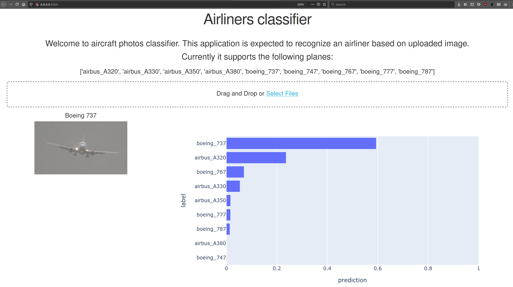

# Introduction
Project contains dockerized application that can recognize an airliner model based on uploaded image.  
  
Apart from essential elements for docker image building, this repository includes additional folders:
* exaples: sample images of planes so that user can quickly test the application (but is encouraged to try their own photos);
* modeling: jupyter notebooks with data scraping, clearing and model training process (originally run on Google Colab).

## Build and run
```
docker build -t airplane-classifier .
docker run -p 8000:8000 airplane-classifier
```
Final image takes ~2.6GiB of space (fastai and pytorch libraries are quite heavy).

## Access the page
Go to to `http://localhost:8000/` in browser and enjoy :)